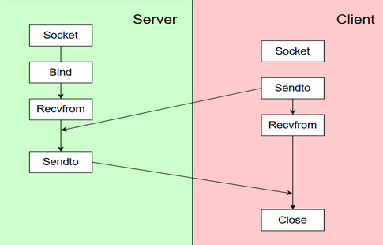

<!-- #!/bin/bash

if [ "$0" == "$BASH_SOURCE" ]; then
    echo "이 스크립트는 실행이 아닌 소스로 사용되어야 합니다."
    echo "사용법: source $0"
    exit 1
fi-->

<!-- ->
## PS1 환경 변수를 변경함으로써 activated가 앞에 나오게끔 변경
## (activated) ubuntu@ip-172-31-41-14:~/carina$
export PS1="(activated) \[\e[1;32m\]\u\[\e[m\]@\[\e[1;34m\]\h\[\e[m\]:\[\e[1;36m\]\w\[\e[m\]\$ " -->

<!--cd `dirname $BASH_SOURCE`
ROOT_DIR=`pwd`

export PATH=$ROOT_DIR/scripts:$PATH
## sourcing 함으로써 scripts 폴더 내부 파일을 자동으로 실행하게끔 해준다.-->
# ESW Contest 2024 - Autonomous Driving

- 팀명 : 전농동CAR리나
- 팀원 : 신현지, 표기환, 송규현, 이현제, 이규호

## 📁 Total Structure
### Initial Structure

### Total communication

### Process Dependency


## 📁 Project Code Structure
```
├── project
│   ├── Sensor
│   ├── Calc
│   ├── Actuator
│   ├── EM
│   ├── CM
│   ├── SM
│   └── CMakeLists.txt
├── work
│   ├── bin
│   ├── etc
│   ├── include
│   ├── lib
│   ├── share/cmake
│   └── LISENSE
├── scripts
│   ├── ngrok-env
│   ├── deploy
│   └── carina-ssh
├── activate
├── Inference.py
└── model
    ├── For1st-AvOb-microcontroled-model.tar.gz
    ├── model_metadata.json
    ├── saved_model.xml
    ├── worker_0.multi_agent_graph.main_level.main_level.agent_0.csv
    └── worker_0.multi_agent_graph_0.json
